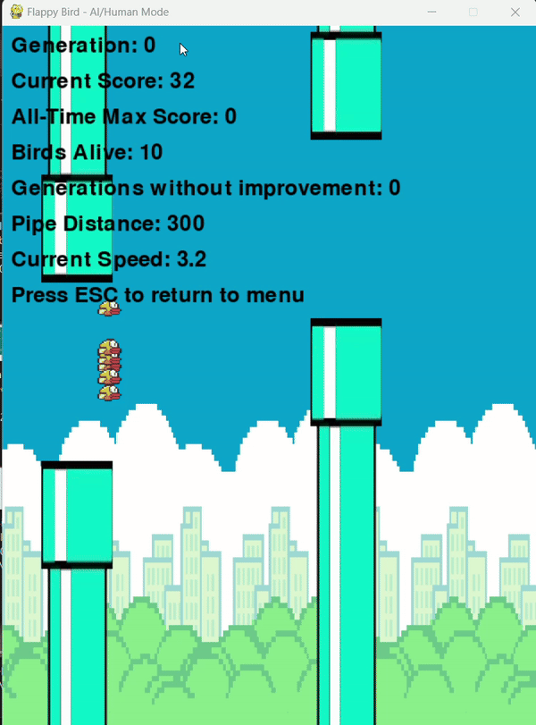

# Flappy.ai
# Flappy Bird AI with Genetic Algorithm

An implementation of the classic Flappy Bird game featuring both human-playable mode and an AI agent trained using genetic algorithms. The AI learns to navigate through pipes by evolving its neural network weights across generations.



## Features

- 🎮 Dual game modes:
  - Human-playable mode with mouse/click controls
  - AI mode with real-time learning visualization
- 🧬 Genetic algorithm implementation:
  - Population size: 100 birds
  - Natural selection based on fitness and score
  - Mutation rate adaptation for optimal learning
- 🧠 Simple neural network for decision making:
  - Inputs: Distance to next pipe and height difference
  - Weights evolve over generations
- 📊 Real-time statistics display:
  - Current generation
  - Score tracking
  - Birds alive
  - Generation performance metrics
- 🎨 Clean graphics with proper sprite rendering
- ⚙️ Adjustable parameters for experimentation

## Requirements

- Python 3.x
- Pygame
- NumPy

## Installation

1. Clone the repository:
```bash
git clone https://github.com/yourusername/flappy-bird-ai.git
cd flappy-bird-ai
```

2. Install required packages:
```bash
pip install pygame numpy
```

3. Make sure you have the following image assets in your project directory in the resourses folder :
- `index.png` (bird sprite)
- `pipe.png` (pipe sprite)
- `background.png` (background image)

## Usage

Run the game:
```bash
python flappy_bird.py
```
 
### Controls

#### Menu
- Up/Down Arrow Keys: Navigate menu options
- Enter: Select game mode
- ESC: Return to menu

#### Human Mode
- Mouse Click/Space: Make bird jump
- ESC: Return to menu

#### AI Mode
- Up Arrow: Increase pipe distance
- Down Arrow: Decrease pipe distance
- ESC: Return to menu

## How the AI Works

### Neural Network Structure
The AI uses a simple neural network with:
- Input Layer: 2 neurons (pipe distance and height difference)
- Output Layer: 1 neuron (jump decision)
- Weights are evolved through genetic algorithm

### Genetic Algorithm Implementation
1. **Initialization**: Creates a population of 100 birds with random neural network weights
2. **Fitness Evaluation**: Birds are evaluated based on:
   - Distance traveled
   - Survival time
   - Pipes passed
3. **Selection**: Top performing birds are selected for breeding
4. **Breeding**: New generation created through:
   - Weight inheritance from best performers
   - Random mutations (10-20% mutation rate)
5. **Iteration**: Process repeats until optimal performance is achieved

## Configuration

Key parameters can be adjusted in the code:

```python
BIRD_COUNT = 100        # Number of birds in population
MUTATION_RATE = 0.1     # Base mutation rate
PIPE_DISTANCE = 300     # Initial distance between pipes
BASE_PIPE_SPEED = 2.5   # Initial game speed
```

## Performance

The AI typically shows significant improvement within 10-15 generations and can achieve consistent high scores after 20-30 generations. Performance may vary based on:
- Initial random weights
- Mutation rate
- Population size
- Pipe spacing and speed

## Contributing

Contributions are welcome! Feel free to open issues or submit pull requests for:
- Performance improvements
- New features
- Bug fixes
- Documentation updates

## License

This project is licensed under the MIT License - see the [LICENSE](LICENSE.md) file for details.

## Acknowledgments

- Original Flappy Bird game by Dong Nguyen
- Pygame community for graphics and game loop implementation
- Neural network and genetic algorithm inspiration from various online resources
